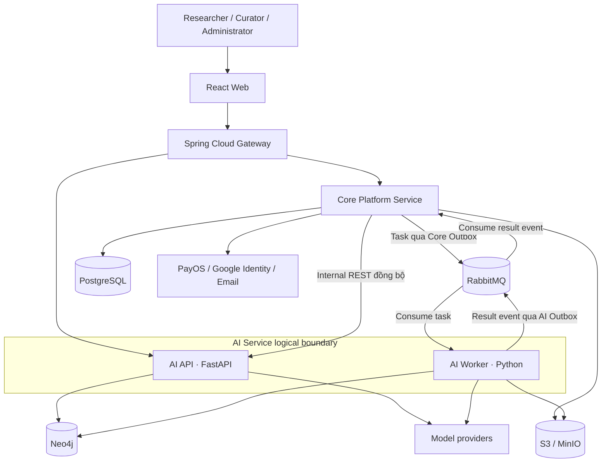
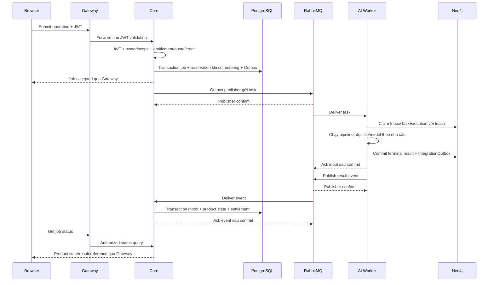

# Kiến trúc SciGraphRAG và đặc tả cấu trúc thư mục cho Codex

Ngày soạn: 1 tháng 10 năm 2026  
Đề tài: Cross Paper GraphRAG for Discovering Hidden Multi Hop Connections in Scientific Literature  
Nguồn nghiệp vụ: aligned baseline 3.0  
Mục đích: dùng tài liệu này làm đầu vào cho Codex dựng cấu trúc repository và skeleton của hệ thống.

Kiến trúc đích: microservices gồm hai service nghiệp vụ, áp dụng Clean Architecture bên trong Core và AI. Chế độ tạo cây mặc định: STRUCTURE_ONLY.

Tài liệu mô tả kiến trúc đích, trách nhiệm từng thành phần, cấu trúc thư mục, chiều phụ thuộc, dữ liệu, giao tiếp và tiêu chí kiểm tra skeleton. Tại thời điểm soạn, thư mục nguồn chỉ có tài liệu; chưa có mã nguồn để xác nhận hệ thống đã triển khai.

## 1. Cách sử dụng tài liệu

Đặt file này vào repository dự án rồi yêu cầu Codex thực hiện phần 19. Tất cả đường dẫn trong cây thư mục là tương đối với repository root. Nếu đã có repository, dựng cấu trúc tại root hiện có; không tạo thêm một repository lồng bên trong.

Phân biệt ba mức quyết định:

| Nhãn | Ý nghĩa | Codex xử lý |
|---|---|---|
| BASELINE | Quyết định lấy từ bốn tài liệu nguồn | Giữ đúng khi dựng skeleton |
| SCAFFOLD | Quy ước tổ chức code được đề xuất trong file này | Dùng làm mặc định cho repository mới; thích nghi với repo hiện có và ghi lại mapping |
| TO PIN | Chi tiết chưa được nguồn chốt hoặc chưa được kiểm chứng | Ghi TODO/ADR; không tuyên bố đã triển khai hoặc tự biến thành quyết định BASELINE |

Monorepo, tên thư mục, Java package, cách chia layer và tên file trong phần 5–9 đều là SCAFFOLD. Số service, ownership dữ liệu và chiều giao tiếp là BASELINE.

Phạm vi mặc định khi đưa file cho Codex là **STRUCTURE_ONLY: tạo cấu trúc thư mục và tài liệu hướng dẫn** theo phần 5.3. Entry point, build manifest, schema, migration và Compose trong các cây còn lại mô tả đích của bước implementation; chưa bắt buộc tạo trong chế độ này. Chỉ chuyển sang BUILDABLE_SKELETON khi người dùng yêu cầu app/skeleton chạy được. Không tự triển khai toàn bộ 23 tính năng, chạy thanh toán, gọi model trả phí, deploy hoặc tạo dữ liệu production.

## 2. Nguồn và phạm vi hệ thống

| Nguồn | Nội dung có thẩm quyền |
|---|---|
| `techstack_architecture.md` | Tech stack, component, service boundary, REST/message, security, deployment |
| `SciGraphRAG_System_Feature_Definition_Co_Thanh_Toan(3).docx` | 23 feature F01–F23, actor, phạm vi và business rules |
| `SciGraphRAG_Workflow_Co_Thanh_Toan_Code_Ready(2).docx` | 10 workflow WF01–WF10, luồng nghiệp vụ và trạng thái |
| `SciGraphRAG_Database_Co_Thanh_Toan(3)(1).docx` | 22 relational table, graph node/relationship, identifier và constraint |

Không suy ra rằng tên file có chữ Code Ready đồng nghĩa đã có implementation. Nếu các nguồn mâu thuẫn, ghi rõ quyết định cần giải quyết trong `docs/architecture/open-decisions.md`; không âm thầm thay business rule.

Hệ thống phục vụ:

- Researcher: quản lý Project/Corpus/Paper, hỏi đáp và khám phá graph, quản lý Plan và usage.
- Curator: review target và evidence trong Review Task được giao.
- Administrator: quản trị account, Plan, billing, credits, jobs và đối soát.
- System: xử lý AI, build graph, phát hiện review candidate và settlement tự động.

MVP có một Researcher owner cho mỗi Project. Chưa có ProjectMember, collaboration, curator marketplace, payout, escrow hoặc KYC.

## 3. Kiến trúc tổng thể

### 3.1 Logical service và runtime

Hệ thống có **hai business service**:

1. **Core Platform Service**: identity, research workspace metadata, billing, credits, product job, curation assignment và audit.
2. **AI Service**: tài liệu khoa học, graph/vector, retrieval, GraphRAG/PathRAG, community, discovery và scientific graph mutation.

AI Service có hai process độc lập là AI API và AI Worker. Chúng dùng chung domain/application/infrastructure code trong một codebase, có entry point riêng và scale riêng. Gateway là thành phần hạ tầng routing, không phải business service thứ ba.



Đường `Core → AI API` và `Core → RabbitMQ → AI Worker` là hai channel độc lập. Heavy task do Core khởi tạo luôn đi qua RabbitMQ tới Worker. AI API không phải cầu nối bắt buộc giữa Core và Worker.

Sơ đồ thể hiện kết nối ownership chính. AI API muốn dùng model trong một operation có tính credit phải đi theo contract ở phần 12.3; kết nối model không tự cho phép bỏ qua Core.

### 3.2 Tech stack

| Thành phần | BASELINE |
|---|---|
| Web | React, TypeScript, Vite, Ant Design, Cytoscape.js |
| Gateway | Java 21, Spring Cloud Gateway |
| Core | Java 21, Spring Boot 4.1.x, Spring Security, OAuth2 Resource Server |
| Core messaging | Spring AMQP |
| AI API | Python 3.12, FastAPI, Pydantic |
| AI Worker | Python 3.12, `aio-pika`, shared AI domain code |
| Đồng bộ | Internal REST trong private network |
| Bất đồng bộ | RabbitMQ, neutral versioned JSON |
| Core database | PostgreSQL |
| AI database | Neo4j, gồm graph và vector index |
| File | S3-compatible object storage; MinIO cho local |
| Authentication | Core phát JWT ký bất đối xứng; Gateway/Core/AI API xác minh |
| External identity/payment | Google Identity, email OTP, PayOS |
| Local deployment | Docker Compose |
| Research | PathRAG fork pin theo Git commit; semantic enriched node representation |

Spring Boot 4.1.x là family version được tài liệu nguồn chỉ định, chưa phải patch đã kiểm chứng. Spring Cloud BOM, package versions, image digests và model snapshots còn TO PIN.

SCAFFOLD về công cụ: Maven cho hai Java app, `uv` cho AI, npm cho Web. Đây là quy ước đề xuất để tạo skeleton, không phải quyết định có sẵn trong nguồn. Giữ package manager hiện có nếu repository đã dùng công cụ khác. Không tạo nhiều lockfile cho cùng một app.

### 3.3 Các ràng buộc phải giữ

1. Gateway là public API entry point; không route vào Worker.
2. Core không chạy scientific pipeline và không có credential Neo4j.
3. AI API/Worker không có credential PostgreSQL của Core.
4. Không shared database, cross-database join hoặc cross-database foreign key.
5. Core tạo product job, kiểm tra quyền/quota/credit rồi publish heavy task qua Outbox.
6. Worker consume trực tiếp từ RabbitMQ và publish result event qua AI Outbox.
7. Không dùng Redis làm broker; không dùng Celery-specific protocol giữa Java và Python.
8. Inbox/Outbox/task xử lý idempotent; broker không là nguồn sự thật nghiệp vụ.
9. PDF/artifact lớn ở object storage; message chỉ chứa reference/checksum.
10. Gateway kiểm tra JWT trước; Core/AI API kiểm tra lại và authorize theo resource.
11. Worker không xác thực JWT người dùng; quyền đã được Core kiểm tra trước khi tạo task.
12. Project có một owner; Curator bị giới hạn theo assignment/task scope.
13. Claim khoa học phải truy về evidence và build; hidden path không tự tạo direct relation mới.
14. Curation task chỉ RESOLVED sau khi graph apply được xác nhận.
15. Payment/credit/curation history giữ được lịch sử; correction dùng record mới.
16. Không thêm business service, Kubernetes, service mesh hoặc dynamic service discovery trong MVP.

## 4. Ranh giới component

| Component | Trách nhiệm | Giới hạn |
|---|---|---|
| Web | Gửi request/access token, render UI, graph và trạng thái | Không tự quyết định payment success, authorization hoặc credit settlement |
| Gateway | Route, JWT lớp đầu, CORS, size limit, rate limit, correlation ID, timeout, TLS theo môi trường | Không query database nghiệp vụ, tính credit hoặc kiểm tra owner bằng business rule |
| Core | Nguồn sự thật platform; authenticate, authorize, billing, jobs, curation orchestration | Không dùng Cypher và không gọi HTTP vào Worker |
| AI API | Validate HTTP request, JWT, scope, bounded graph/retrieval operation | Không nhận heavy task từ Core để chuyển tiếp tới Worker |
| AI Worker | Execute long-running use case, lease/retry, ghi AI result/outbox | Không có public REST port; không phát token hay sửa wallet |
| PostgreSQL | Core business state và Core Inbox/Outbox | Không lưu scientific graph/vector thay Neo4j |
| Neo4j | Scientific graph/vector và AI runtime state/Inbox/Outbox | Không lưu password, OTP, refresh token, payment hoặc credit balance |
| Object Storage | PDF, parsed artifact, generated report khi feature được triển khai | Không giữ business balance hoặc quyền truy cập như source of truth |

## 5. Repository và cây thư mục cấp cao

### 5.1 Monorepo đề xuất

```text
scigraphrag/                         # Minh họa repository root, không bắt buộc tên checkout
├── README.md
├── SCIGRAPHRAG_ARCHITECTURE_CODEX.md
├── .gitignore
├── .env.example
├── apps/
│   └── web/
├── services/
│   ├── gateway/
│   ├── core-service/
│   └── ai-service/                  # Một codebase, hai runtime
├── contracts/
│   ├── README.md
│   ├── http/
│   │   ├── public/
│   │   └── internal/
│   ├── messaging/
│   │   ├── envelope/
│   │   ├── commands/
│   │   └── events/
│   └── examples/
│       ├── http/
│       └── messaging/
├── infra/
│   ├── compose/
│   ├── rabbitmq/
│   ├── postgres/
│   ├── neo4j/
│   ├── minio/
│   └── observability/
├── docs/
│   ├── architecture/
│   │   ├── overview.md
│   │   ├── module-boundaries.md
│   │   ├── data-ownership.md
│   │   └── open-decisions.md
│   ├── adr/
│   ├── workflows/
│   ├── database/
│   ├── runbooks/
│   └── source/
├── scripts/
│   ├── dev/
│   └── checks/
├── tests/
│   ├── contracts/
│   └── end-to-end/
└── research/
    ├── README.md
    ├── baseline/
    ├── adapters/
    ├── datasets/
    ├── configs/
    ├── experiments/
    ├── evaluation/
    └── results/
```

`contracts/` chỉ giữ contract và examples. Không tạo Java/Python shared entity library hoặc shared database model. Mỗi service tự chuyển contract sang domain model của mình.

`infra/` giữ cấu hình provision/deployment; migration thuộc service sở hữu database. `docs/source/` có thể chứa bản sao tài liệu tham chiếu nếu cần; giữ nguyên bản gốc. `research/` không trở thành production service hoặc nơi chứa credential/dataset nhạy cảm trong Git.

Không đưa `.architecture_read/`, build output, virtual environment, PDF người dùng, model weights hoặc database volumes vào cây đích.

### 5.2 Quy tắc tạo file và thư mục

- Tên path: app/service/module dùng kebab-case; Python package dùng snake_case; Java package viết thường.
- App/service/module root có README mô tả owner, trách nhiệm và TODO. Thư mục lá bắt buộc còn rỗng giữ bằng `.gitkeep`; thư mục đã có README hoặc file khác không cần `.gitkeep`. Git không lưu thư mục rỗng. Không cần một class rỗng cho mỗi tên nghiệp vụ.
- Cây ở phần 6–9 là cấu trúc đích. File như entry point, config và manifest chỉ tạo thành code chạy được khi dependency/config đã xác minh; nếu chưa, ghi skeleton status rõ.
- Không tạo placeholder sai cú pháp như OpenAPI rỗng được quảng cáo là contract hoàn chỉnh hoặc version `latest` được coi đã pin.
- `.env.example` dùng giá trị minh họa, không chứa secret thật. Chỉ đọc env phù hợp với service.
- Root README có link tới từng service, cách chạy từng process, trạng thái skeleton và các TO PIN còn lại.

### 5.3 Đặc tả cây bắt buộc cho STRUCTURE_ONLY

Phần này là quy tắc ưu tiên khi quyết định **phải tạo gì ngay**. Các cây ở phần 6–9, 11 và 15 vẫn mô tả cấu trúc đích chi tiết, nhưng không tự làm tăng phạm vi sang code runnable.

| Nhóm | Thư mục bắt buộc tạo ngay |
|---|---|
| Root | Tất cả thư mục trong cây 5.1: apps, services, contracts, infra, docs, scripts, tests, research và các nhánh đã liệt kê |
| Web | `apps/web/public/`; `apps/web/src/app/` với router/providers/layouts; 12 feature root và các nhánh shared trong cây 6.1 |
| Gateway | `services/gateway/src/main/java/com/scigraphrag/gateway/` với config/security/filters/routing/errors/observability; resources và test package trong cây 7.1 |
| Core nền tảng | `services/core-service/src/main/java/com/scigraphrag/core/` với config/security/common/modules; resources/db/migration, test Java package và test/resources trong cây 8.1 |
| Core nghiệp vụ | Tám module root identity/workspace/billing/credits/jobs/curation/audit/integration, mỗi root có đúng bốn nhánh domain/application/infrastructure/presentation ở bước đầu |
| Core administration | `modules/administration/` bên dưới Core Java package, chỉ có application/presentation |
| AI | Tất cả thư mục trong cây 9.1; bỏ qua các file code/build được minh họa trong cây ở chế độ này |
| Contracts/infra/research | Các thư mục theo cây 5.1, 11.1 và 15.2; nội dung hiện tại là README và TODO, chưa tạo schema/config/runner |

Cụ thể với Core: với mỗi tên trong tập `identity`, `workspace`, `billing`, `credits`, `jobs`, `curation`, `audit`, `integration`, tạo các đường dẫn sau bằng cách thay `{module}` bằng tên thực tế:

```text
services/core-service/src/main/java/com/scigraphrag/core/modules/{module}/domain/
services/core-service/src/main/java/com/scigraphrag/core/modules/{module}/application/
services/core-service/src/main/java/com/scigraphrag/core/modules/{module}/infrastructure/
services/core-service/src/main/java/com/scigraphrag/core/modules/{module}/presentation/
```

`{module}` chỉ là ký hiệu thay thế, không là tên thư mục. Các nhánh model/policy/usecase/ports/persistence/rest/dto của Core và pages/components/api/hooks/types trong từng Web feature được thêm khi có implementation cần chúng. Chưa tạo những nhánh chi tiết đó hàng loạt trong STRUCTURE_ONLY.

AI phải dùng các vị trí chính xác sau:

```text
services/ai-service/src/scigraphrag_ai/api/
services/ai-service/src/scigraphrag_ai/workers/
services/ai-service/src/scigraphrag_ai/bootstrap/
services/ai-service/src/scigraphrag_ai/domain/
services/ai-service/src/scigraphrag_ai/application/
services/ai-service/src/scigraphrag_ai/infrastructure/
services/ai-service/src/scigraphrag_ai/common/
services/ai-service/resources/prompts/
services/ai-service/resources/pipeline_configs/
services/ai-service/migrations/neo4j/
services/ai-service/tests/unit/
services/ai-service/tests/integration/
services/ai-service/tests/fixtures/
```

Tạo các nhánh con đã liệt kê trong cây 9.1 bên dưới các vị trí này. `api/` và `workers/` là inbound/transport adapters của Clean Architecture; không tạo thêm `presentation/` trong AI và không tạo `services/ai-api/` hoặc `services/ai-worker/`. `resources/` nằm ngoài Python package, không đặt vào `src/scigraphrag_ai/resources/`.

Các file cần tạo ở STRUCTURE_ONLY:

1. Root README, file architecture này, `.gitignore` và `.env.example`.
2. README ở mỗi app/service, tám Core module và administration, 12 Web feature, các nhóm AI domain/application, cùng các nhóm contracts/infra/research. Dùng `.gitkeep` cho các thư mục lá bắt buộc khác còn rỗng.
3. `docs/architecture/overview.md`, `module-boundaries.md`, `data-ownership.md`, `open-decisions.md` và `scaffold-status.md`. File scaffold-status ghi mode, tree thực tế, file đã tạo và các phần chưa triển khai.
4. README trong các nhóm docs/workflows, docs/database, docs/runbooks, docs/adr, docs/source, scripts và tests để mô tả mục đích, không tạo kết quả test hoặc dữ liệu mẫu giả.

`.env.example` là tài liệu cấu hình minh họa, phải ghi chưa có runtime tự load env trong STRUCTURE_ONLY. Root README ghi runtime entry point **dự kiến**, không đưa ra lệnh được quảng cáo chạy ngay khi chưa có code.

Chưa tạo package.json/pom.xml/pyproject.toml, lockfile, Dockerfile, source entry point, OpenAPI/JSON Schema, SQL/Cypher migration hoặc compose.yaml trong mode mặc định. Chúng thuộc BUILDABLE_SKELETON/implementation, cần dependency/contract phù hợp trước khi tạo. Thư mục research/results có thể chỉ được giữ bằng `.gitkeep`; không tạo kết quả thí nghiệm.

### 5.4 Quy tắc cho repository đã có source

Các đường dẫn bắt buộc ở 5.3 là mặc định cho repository mới. Với repo hiện có, giữ module/path tương đương và ghi mapping trong scaffold-status; không tạo cấu trúc song song chỉ để khớp tên mẫu. Không chỉnh/xóa manifest, source hoặc lockfile hiện có vì STRUCTURE_ONLY không tạo chúng mới.

Nếu thư mục đang mở chỉ là nơi giữ tài liệu, Codex cần sử dụng repository đích đã được người dùng chỉ định. Không tự đổi thư mục tài liệu thành repository ứng dụng khi người dùng chỉ yêu cầu đánh giá hoặc cải tiến file này.

## 6. Frontend

### 6.1 Cấu trúc `apps/web`

```text
apps/web/
├── README.md
├── package.json
├── package-lock.json                # Chỉ tạo bằng npm sau khi dependencies được chọn
├── tsconfig.json
├── vite.config.ts
├── index.html
├── .env.example
├── public/
└── src/
    ├── main.tsx
    ├── app/
    │   ├── App.tsx
    │   ├── router/
    │   ├── providers/
    │   └── layouts/
    ├── features/
    │   ├── identity/
    │   ├── workspace/
    │   ├── papers/
    │   ├── graph/
    │   ├── qa/
    │   ├── discovery/
    │   ├── communities/
    │   ├── billing/
    │   ├── credits/
    │   ├── jobs/
    │   ├── curation/
    │   └── administration/
    └── shared/
        ├── api/
        ├── auth/
        ├── components/
        ├── hooks/
        ├── styles/
        ├── types/
        └── utils/
```

Mỗi feature chỉ tạo các thư mục cần thiết trong tập sau: `pages/`, `components/`, `api/`, `hooks/`, `types/` khi implementation bắt đầu. Trong STRUCTURE_ONLY, tạo feature root và README là đủ. Không lặp domain/application/infrastructure ở frontend.

| Feature folder | Trách nhiệm |
|---|---|
| `identity` | Đăng ký, OTP, login, profile và session UI |
| `workspace` | Project và Corpus |
| `papers` | Upload/import, metadata, paper status và nguồn PDF |
| `graph` | Cytoscape rendering, bounded expansion, filter, entity/relation/evidence |
| `qa` | Câu hỏi, answer, citations và insufficient evidence |
| `discovery` | Chọn endpoints, paths 2–4 hop, score/evidence từng hop |
| `communities` | Community map và trend summary |
| `billing` | Plans, checkout, subscription lifecycle và payment status |
| `credits` | Wallet, reserved amount, ledger và usage |
| `jobs` | Theo dõi product job, progress/failure/reconciliation |
| `curation` | Assigned queue, review workspace và action submission |
| `administration` | Account/plan/billing/job operations và audit UI |

### 6.2 Chiều phụ thuộc

`app → features → shared`. Shared không import feature; feature gọi nhau qua public exports rõ ràng nếu cần. HTTP client chung ở `shared/api`; URL public chỉ trỏ Gateway, không chứa private Core/AI URL.

Route guard hỗ trợ UX; backend vẫn quyết định quyền. Web không lưu private signing key hoặc model/payment secret. Không tự cộng credit theo return URL của PayOS.

Graph UI luôn gửi node/edge/depth limit và giữ `projectId`/`buildId` của kết quả. Citation liên kết về paper/chunk/page/span. Skeleton chưa cần UI hoàn chỉnh hoặc thư viện state management bổ sung ngoài stack nguồn.

TO PIN: router library, refresh-token transport, state/cache library. Theo dõi job bằng polling có giới hạn là SCAFFOLD mặc định; SSE/WebSocket chỉ thêm khi có yêu cầu và contract.

## 7. API Gateway

### 7.1 Cấu trúc `services/gateway`

```text
services/gateway/
├── README.md
├── pom.xml
├── Dockerfile
├── .env.example
└── src/
    ├── main/
    │   ├── java/com/scigraphrag/gateway/
    │   │   ├── GatewayApplication.java
    │   │   ├── config/
    │   │   ├── security/
    │   │   ├── filters/
    │   │   ├── routing/
    │   │   ├── errors/
    │   │   └── observability/
    │   └── resources/
    │       ├── application.yml
    │       └── application-local.yml
    └── test/
        └── java/com/scigraphrag/gateway/
```

Java namespace `com.scigraphrag` là SCAFFOLD. Gateway chỉ có cấu hình kỹ thuật và filter, không có entity/repository/database migration hay feature service.

### 7.2 Routing đích đề xuất

Tên URL là SCAFFOLD; ownership đích là BASELINE.

| Public route class | Destination | Quy tắc |
|---|---|---|
| `/api/v1/auth/**`, `/api/v1/me/**` | Core | Chỉ auth endpoint được chỉ định rõ mới anonymous |
| `/api/v1/projects/**`, `/api/v1/papers/**`, `/api/v1/corpora/**` | Core | Workspace, metadata, upload orchestration |
| `/api/v1/plans/**`, `/api/v1/subscriptions/**`, `/api/v1/payments/**`, `/api/v1/credits/**` | Core | Billing/entitlement/usage |
| `/api/v1/jobs/**`, `/api/v1/review-tasks/**`, `/api/v1/admin/**` | Core | Product jobs, curation và administration |
| `/api/v1/graph/**`, `/api/v1/evidence/**` | AI API | Bounded read, sau JWT và resource authorization |
| `/api/v1/ai-jobs/**` | Core | Khởi tạo operation AI nặng/có usage theo phần 12 |
| `/webhooks/payos` | Core | Không dùng end-user JWT; xác minh provider signature/reference ở Core |

Không route public `/internal/**`, worker endpoint, database/management port hoặc JWKS private operation. Nếu cần public JWKS, chỉ expose endpoint public key đọc được đã chỉ định, không expose signing key.

Gateway loại bỏ header identity/service giả mạo từ client trước khi tạo header của chính nó. Correlation ID phải được validate hoặc cấp mới. Service đích vẫn kiểm tra JWT, không tin header claims thay JWT.

TO PIN: Spring Cloud flavor/BOM tương thích với Spring Boot family nguồn, TLS termination cụ thể và rate-limit implementation. Không tự thêm Redis. Skeleton đơn replica có thể để rate-limit adapter/config TODO, không đánh dấu đã bảo vệ khi chưa triển khai.

## 8. Core Platform Service

### 8.1 Cách tổ chức code

Core là một Spring Boot application được chia module theo nghiệp vụ. Module là package trong cùng service, không là microservice hay deployment riêng. Dùng cách tổ chức feature trước, layer bên trong feature.

```text
services/core-service/
├── README.md
├── pom.xml
├── Dockerfile
├── .env.example
└── src/
    ├── main/
    │   ├── java/com/scigraphrag/core/
    │   │   ├── CoreApplication.java
    │   │   ├── config/
    │   │   ├── security/
    │   │   ├── common/
    │   │   └── modules/
    │   │       ├── identity/
    │   │       ├── workspace/
    │   │       ├── billing/
    │   │       ├── credits/
    │   │       ├── jobs/
    │   │       ├── curation/
    │   │       ├── audit/
    │   │       ├── integration/
    │   │       └── administration/   # Presentation/application orchestration, không domain riêng
    │   └── resources/
    │       ├── application.yml
    │       ├── application-local.yml
    │       └── db/migration/
    └── test/
        ├── java/com/scigraphrag/core/
        └── resources/
```

Với tám module có domain, cấu trúc đích là:

```text
modules/<module>/
├── README.md
├── domain/
│   ├── model/
│   ├── policy/
│   └── exception/
├── application/
│   ├── usecase/
│   ├── command/
│   ├── query/
│   ├── result/
│   └── port/
│       ├── inbound/
│       └── outbound/
├── infrastructure/
│   ├── persistence/
│   └── adapters/                   # Chỉ thêm adapter cần thiết cho module
└── presentation/
    ├── rest/
    └── dto/
```

`administration/` chỉ cần README, `application/` và `presentation/`; nó gọi public use case của các module khác. Không tạo admin database/entity riêng.

Khung bắt buộc của từng module trong STRUCTURE_ONLY được chốt ở 5.3. Domain/application/infrastructure/presentation và README ở mỗi module là khung tối thiểu; các nhánh chi tiết được thêm khi có file thực tế. Administration dùng ngoại lệ đã nêu, không tạo domain/infrastructure riêng.

### 8.2 Layer và dependency rule

| Layer | Nội dung | Được phụ thuộc |
|---|---|---|
| `domain` | Model, invariant, state guard, business policy | Java standard library và common value type thuần |
| `application` | Use case, orchestration, transaction boundary, ports | Domain và application API/port rõ ràng của module liên quan |
| `infrastructure` | PostgreSQL adapter, provider client, REST/AMQP implementation | Application ports và domain |
| `presentation` | Controller, request/response DTO, transport mapping | Application inbound port/use case |
| `config` | Dependency wiring và framework configuration | Các adapter/use case cần wiring |

Domain không import Spring, JPA, HTTP, AMQP, FastAPI hoặc DTO của transport. Application có thể dùng Spring transaction annotation khi triển khai; domain vẫn thuần. JPA entity nếu chọn JPA thuộc persistence adapter, không là shared entity giữa service.

Module không truy cập repository implementation hoặc bảng của module khác để bỏ qua invariant. Dùng application facade/port. `integration` nhận event và gọi use case của `jobs`, `credits`, `curation` trong local transaction cần thiết.

`common/` chỉ chứa error/value type/correlation helper nhỏ. Không đưa logic billing, owner, wallet hay graph vào common. `security/` chứa request JWT verification/principal và config; identity module vẫn sở hữu phát token/session.

### 8.3 Module catalog

| Module | Data owner | Use case/port tiêu biểu |
|---|---|---|
| `identity` | `users`, `auth_identities`, `auth_sessions`, `email_verification_otps` | Register, VerifyOtp, Login, Refresh, Logout, profile, account status; EmailSender, GoogleIdentityVerifier, TokenSigner |
| `workspace` | `projects`, `corpora`, `papers` | Create/ArchiveProject, CreateCorpus, ImportPaper, DuplicateCheck, ValidateOwner; ObjectStorage, metadata import source |
| `billing` | `features`, `plans`, `plan_features`, `subscriptions`, `payment_transactions`, `webhook_events` | Plan catalog, Checkout, ConfirmPayment, lifecycle, CheckEntitlement/Quota; PayOSClient |
| `credits` | `credit_wallets`, `credit_ledger`, `usage_events` | Estimate, Reserve, Settle, Release, Adjustment; wallet locking/version policy |
| `jobs` | `ai_jobs` | SubmitAiJob, GetJob, RequestRetry/Cancel, ApplyAiOutcome; access/entitlement/credit ports, AiQueryClient |
| `curation` | `review_tasks`, `curation_actions` | Create/Assign/StartReview, RecordDecision, ConfirmGraphApply; scientific target validation port |
| `audit` | `audit_events` | AppendAuditEvent, authorized audit query |
| `integration` | `outbox_events`, `inbox_events` | Local outbox write, publish, consume/dedup, dispatch, reconciliation; RabbitMQ adapters |
| `administration` | Không thêm bảng | Gọi use case quản trị account/plan/payment/wallet/job/audit của owner module |

Tên use case là SCAFFOLD, không yêu cầu sinh một class cho mọi dòng ngay lập tức. `jobs` điều phối AI; `workspace` sở hữu Paper metadata/status update qua application API.

Không giữ PostgreSQL transaction mở trong thời gian upload lớn, gọi PayOS, gọi model, Internal REST hoặc chờ AI job. Tách giao tiếp bên ngoài khỏi transaction business phù hợp và xử lý uncertain outcome bằng reconciliation.

### 8.4 Hạ tầng cụ thể

- PostgreSQL mapping/repository theo từng module; migration tổng của Core ở `src/main/resources/db/migration/`.
- Chọn công cụ migration như Flyway khi pin dependency; lựa chọn này là SCAFFOLD, chưa có SQL physical schema trong nguồn.
- Spring AMQP adapters ở `modules/integration/infrastructure/`; Outbox record được ghi trong cùng transaction với business mutation.
- REST client tới AI API là outbound adapter của use case cần nó; không đặt controller HTTP client trong domain.
- S3 adapter của workspace quản lý upload/reference; grants cho Worker qua credential/policy riêng.
- Provider secret chỉ đọc ở adapter/config tương ứng. Không đưa secret vào audit, message, DTO hoặc `.env.example`.

## 9. AI Service

### 9.1 Cấu trúc một codebase với hai entry point

```text
services/ai-service/
├── README.md
├── pyproject.toml
├── uv.lock                         # Chỉ tạo sau khi dependency versions được xác minh
├── Dockerfile.api
├── Dockerfile.worker
├── .env.example
├── src/scigraphrag_ai/
│   ├── __init__.py
│   ├── bootstrap/
│   │   ├── settings.py
│   │   └── container.py
│   ├── api/
│   │   ├── main.py
│   │   ├── routers/
│   │   ├── schemas/
│   │   ├── dependencies/
│   │   ├── middleware/
│   │   └── errors/
│   ├── workers/
│   │   ├── main.py
│   │   ├── consumers.py
│   │   ├── handlers/
│   │   ├── outbox_publisher.py
│   │   └── lifecycle.py
│   ├── application/
│   │   ├── documents/
│   │   ├── graph/
│   │   ├── retrieval/
│   │   ├── curation/
│   │   ├── jobs/
│   │   └── ports/
│   ├── domain/
│   │   ├── documents/
│   │   ├── graph/
│   │   ├── retrieval/
│   │   ├── curation/
│   │   ├── jobs/
│   │   └── integration/
│   ├── infrastructure/
│   │   ├── neo4j/
│   │   │   ├── repositories/
│   │   │   ├── queries/
│   │   │   └── unit_of_work.py
│   │   ├── rabbitmq/
│   │   ├── object_storage/
│   │   ├── model_providers/
│   │   ├── pdf_parsing/
│   │   ├── extraction/
│   │   ├── entity_resolution/
│   │   ├── representation/
│   │   ├── embeddings/
│   │   ├── pathrag/
│   │   ├── community_detection/
│   │   ├── authorization/
│   │   └── observability/
│   └── common/
├── resources/
│   ├── prompts/
│   └── pipeline_configs/
├── migrations/
│   └── neo4j/
└── tests/
    ├── unit/
    ├── integration/
    └── fixtures/
```

Tên package `scigraphrag_ai` và `src/` layout là SCAFFOLD. Không tạo một ai-api repository và một ai-worker repository với hai bản sao pipeline. Hai Dockerfile build từ cùng source/package.

Entry point đích sau khi app chạy được:

```text
AI API:     uvicorn scigraphrag_ai.api.main:app
AI Worker:  python -m scigraphrag_ai.workers.main
```

Đây là cách gọi sau khi package được cài đúng trong môi trường, chưa phải xác nhận hiện có command chạy được. API/Worker chỉ khởi tạo connection và loop trong lifecycle của runtime tương ứng, không có side effect network/model khi import domain.

### 9.2 Phân chia trách nhiệm

| Package | Trách nhiệm |
|---|---|
| `api` | HTTP transport, Pydantic schemas, JWT dependency, authorization dependency, bounded query |
| `workers` | AMQP consumption, schema validation, dispatch, ack/nack, heartbeat và shutdown |
| `application/documents` | Parse/chunk/provenance và paper processing use case |
| `application/graph` | Extraction, resolution, representation, embedding, build/rebuild và quality gates |
| `application/retrieval` | Explore, evidence, grounded QA, multi-hop và community analysis |
| `application/curation` | Apply approve/reject/edit/merge/split với scope/version/action guards |
| `application/jobs` | Runtime orchestration, claim/lease, attempts, progress và outcome |
| `application/ports` | Neo4j UoW/repository, storage, model, parser, extraction, authz và integration ports |
| `domain` | Scientific model, evidence/path invariants, state và policy thuần |
| `infrastructure` | Implementation của ports; Cypher, AMQP, S3, parser/model/PathRAG adapters |
| `bootstrap` | Load settings và wire dependencies cho từng runtime |
| `resources` | Prompt/config có version để tái lập pipeline |

AI integration không là runtime/service riêng: domain integration records ở `domain/integration`, persistence ở `infrastructure/neo4j`, broker adapters ở `infrastructure/rabbitmq`, consumer/publisher loop ở `workers`.

### 9.3 Dependency rule

`api/workers → application → domain`; infrastructure implements application ports; bootstrap wire concrete implementations. Application/domain không import routers, consumer entry point hoặc concrete driver.

Domain dùng dataclass/enum/value object thuần khi phù hợp. Pydantic cho HTTP/message/settings ở boundary. Không đưa Neo4j driver result, FastAPI Request hoặc AMQP message vào scientific domain API.

Worker handler mỏng: validate envelope, gọi application use case, xử lý delivery theo outcome. Pipeline logic không đặt trong handler/routers.

`PathRAG`, extraction model, entity resolution, parser và embedding provider đều ở sau adapter/port. Chưa chốt SciBERT/LLM/hybrid; không sinh code khẳng định một lựa chọn đã freeze.

### 9.4 Pipeline đích

```text
PROCESS_PAPER
  Object reference → Checksum validation → PDF parse
  → Chunk với section/page/span → Embedding/provenance
  → Commit AI outcome + Outbox

BUILD_GRAPH
  Corpus snapshot với Paper READY → Extraction → Entity resolution
  → Node representation → Embedding → Scientific relations + evidence
  → Quality gates → GraphBuild READY/FAILED → Activation có guard
  → Commit AI outcome + Outbox

RETRIEVAL
  Authorized Project/build → Semantic candidates + graph paths
  → Evidence validation/filter → Grounded result
  → Citation hoặc INSUFFICIENT_EVIDENCE/NO_GROUNDED_PATH
```

Quality gate gồm schema validity, duplicate, dangling reference và evidence completeness. Relations PENDING_REVIEW không tham gia reasoning. Graph activation chỉ diễn ra sau build đạt chất lượng; lỗi build không thay active graph cũ.

Một pipeline có thể ghi staging nhiều batch; việc publish terminal success và kích hoạt kết quả phải gắn với local transaction xác nhận trạng thái cuối và Outbox. Không giả định toàn bộ corpus nằm trong một transaction khổng lồ.

## 10. Kiến trúc dữ liệu

### 10.1 Relational catalog

Baseline có đúng **22 bảng**. Danh sách dưới đây là logical model, chưa là DDL hoàn chỉnh. PK là primary key, FK là foreign key trong PostgreSQL của Core, UQ là uniqueness cần thể hiện phù hợp trong physical schema.

| Bảng | Owner module | Các trường/constraint chính từ nguồn |
|---|---|---|
| `users` | identity | `id`, email UQ, full_name, role, status, token_version, timestamps |
| `auth_identities` | identity | `id`, user_id FK, provider, subject, password_hash; UQ(provider, subject) |
| `auth_sessions` | identity | `id`, user_id FK, refresh_token_hash UQ, expires_at, revoked_at, device_info |
| `email_verification_otps` | identity | `id`, email, otp_hash, purpose, status, expires_at, attempt_count, resend_count |
| `projects` | workspace | `id`, owner_user_id FK, name, field, status, active_corpus_id, timestamps |
| `corpora` | workspace | `id`, project_id FK, name, version, status, created_at |
| `papers` | workspace | `id`, project_id FK, corpus_id FK, doi, arxiv_id, checksum, object_key, status |
| `features` | billing | `id`, code UQ, name, metered, active |
| `plans` | billing | `id`, code UQ, price, billing_period, included_credits, status, effective_at |
| `plan_features` | billing | PK(plan_id, feature_id), enabled, quota, credit_cost |
| `subscriptions` | billing | `id`, user_id FK, plan_id FK, status, period_start/end, scheduled_change |
| `payment_transactions` | billing | `id`, user_id FK, order_code UQ, provider_reference UQ, amount, status, idempotency_key UQ |
| `webhook_events` | billing | `id`, provider, provider_event_id UQ, payload_hash, signature_valid, status, received_at |
| `credit_wallets` | credits | `id`, user_id UQ, balance, reserved_balance, version, updated_at |
| `credit_ledger` | credits | `id`, wallet_id FK, entry_type, amount, balance_after, reference, idempotency_key UQ |
| `usage_events` | credits | `id`, user_id FK, project_id FK, job_id UQ, feature_code, estimated, actual, status |
| `ai_jobs` | jobs | `id`, project_id FK, paper_id FK nullable, task_type, status, correlation_id, requested_by, timestamps |
| `review_tasks` | curation | `id`, project_id FK, target_type, target_id, assertion_id, assignee_user_id, status, priority |
| `curation_actions` | curation | `id`, task_id FK, action_type, before_json, after_json, reason, status, idempotency_key UQ |
| `audit_events` | audit | `id`, actor_id, action, target_type, target_id, correlation_id, created_at |
| `outbox_events` | integration | `id`, event_id UQ, aggregate_type/id, event_type, payload_json, status, attempts, next_attempt_at |
| `inbox_events` | integration | event_id PK, event_type, producer, payload_hash, status, processed_at, error_message |

Ràng buộc nghiệp vụ:

- User 1–N AuthIdentity/AuthSession/Project; một wallet/User.
- Project 1–N Corpus; Corpus 1–N Paper. Paper.project_id phải khớp Corpus.project_id.
- Plan N–M Feature qua plan_features; User có nhiều Subscription lịch sử nhưng chỉ một current subscription theo policy.
- Project 1–N AIJob; job có tối đa một usage record theo unique job_id, operation có metering phải có usage record.
- Project 1–N ReviewTask; ReviewTask 1–N CurationAction.
- Duplicate paper bị chặn theo Project + DOI/arXiv ID/checksum khi các giá trị hiện diện.
- Một OPEN/IN_REVIEW review cho cùng target/build theo nguồn; physical uniqueness và state guard còn TO PIN.
- Wallet mutation phải đi kèm ledger; reserve/consume/release idempotent, dùng locking/version phù hợp.

Nguồn chưa liệt kê đủ physical fields cho review build/evidence scope, immutable corpus snapshot, Plan version/history, payment currency và job result/artifact. Ghi TO PIN trong database docs; không tự sinh bảng bổ sung để lấp chỗ trống hoặc tuyên bố migration đầy đủ chỉ từ bảng trên.

### 10.2 Graph node catalog

| Label | Khóa | Dữ liệu |
|---|---|---|
| `ProjectRef` | projectId UQ | Reference tối thiểu tới Project, không là nguồn quyền |
| `PaperRef` | paperId UQ, projectId | Paper reference và provenance root |
| `Chunk` | chunkId UQ, paperId | Text, section/page/span, checksum, embedding |
| `Author` | authorId UQ | Tác giả chuẩn hóa |
| `Entity` | entityId UQ, projectId, type | Canonical entity, aliases, representationType/Version/Text, embedding |
| `GraphBuild` | buildId UQ, jobId UQ | Corpus snapshot, pipeline/config version, quality, active flag |
| `Community` | communityId UQ, buildId | Cluster/rank, summary reference và representative evidence |
| `AIJob` | jobId UQ | Runtime state, taskType, projectId/paperId, correlationId |
| `TaskExecution` | taskId UQ, messageId UQ | Claim, attempt, lease, status, startedAt/finishedAt |
| `IntegrationInbox` | messageId UQ | Dedup, payloadHash, receivedAt/processedAt, status |
| `IntegrationOutbox` | eventId UQ | Event payload, aggregateId, attempts, nextAttemptAt, status |

### 10.3 Graph relationship catalog

| Relationship | Hướng | Thuộc tính/quy tắc |
|---|---|---|
| `HAS_PAPER` | ProjectRef → PaperRef | Project nhất quán |
| `HAS_CHUNK` | PaperRef → Chunk | Chunk order, section/page |
| `AUTHORED_BY` | PaperRef → Author | Author order/role khi có |
| `MENTIONS` | Chunk → Entity | mentionId, span, confidence, buildId |
| `USES_METHOD` | Entity → Entity | assertionId UQ, evidenceChunkIds, confidence, status, buildId |
| `EVALUATES_ON` | Entity → Entity | assertionId UQ, evidenceChunkIds, confidence, status, buildId |
| `ACHIEVES_RESULT` | Entity → Entity | assertionId UQ, evidenceChunkIds, confidence, status, buildId |
| `HAS_BUILD` | ProjectRef → GraphBuild | Một active build/Project |
| `HAS_COMMUNITY` | GraphBuild → Community | Algorithm/config version |
| `CONTAINS` | Community → Entity | Membership score/rank |
| `HAS_EXECUTION` | AIJob → TaskExecution | Runtime executions/attempts |

Mỗi scientific assertion dùng cho retrieval có assertionId, buildId và Chunk evidence hợp lệ. Relation excerpt chỉ là bản sao tiện dụng; Chunk là evidence source.

Assertion identity phải không nhập nhằng khi resolve evidence hoặc curation target. Nguồn yêu cầu assertionId UQ; cách enforce uniqueness trên các relationship type và build scope phụ thuộc physical schema/Neo4j edition còn TO PIN. Index tìm kiếm thông thường không thay uniqueness guard.

Neo4j migrations giữ uniqueness/full-text/vector indexes phù hợp với phiên bản/edition đã pin. Embedding dimension và similarity metric phải thống nhất với model. Không sinh vector index với dimension tùy đoán.

TO PIN về versioning: canonical Entity có entityId UQ trong nguồn, nhưng representation/embedding cần so sánh nhiều build/variant. Chốt cách giữ identity so với versioned representation trước physical schema; không overwrite representation đang dùng bởi active build. Các query phải chứng minh membership ở đúng Project/build, không chỉ lọc một ID do client gửi.

### 10.4 File và shared identifiers

```text
PDF gốc:       projects/{projectId}/papers/{paperId}/source.pdf
Parsed output: jobs/{jobId}/parsed.json
Export/report: projects/{projectId}/exports/{exportId}
```

Export/report là convention nguồn cho feature được triển khai sau; skeleton không cần thêm export table/service. Metadata chứa object key, checksum, mime type và size theo physical design đã chốt.

| Identifier | Owner/ý nghĩa |
|---|---|
| `userId` | Core identity; message chỉ giữ audit identity tối thiểu |
| `projectId`, `paperId` | Core workspace; AI giữ reference cùng UUID |
| `jobId` | Core product job; AI runtime job dùng cùng ID |
| `taskId` | Định danh execution command, không là ReviewTask ID |
| `buildId` | AI graph version; Core/request/message tham chiếu khi cần |
| `assertionId` | Scientific relationship được truy evidence/curation |
| `reviewTaskId` | Review assignment của Core; tránh nhập nhằng với taskId của Worker |
| `actionId` | Core curation action; AI dùng chống apply lặp |
| `messageId`, `eventId` | Message/event identity ổn định khi retry publish/delivery |

SQL dùng snake_case; JSON contract dùng camelCase; Python có thể dùng snake_case nội bộ với mapping rõ. Không đổi identity khi chuyển ngôn ngữ.

## 11. Contracts HTTP và messaging

### 11.1 Cấu trúc contract đích

```text
contracts/
├── README.md
├── http/
│   ├── public/
│   │   ├── core.openapi.yaml
│   │   └── ai.openapi.yaml
│   └── internal/
│       ├── ai-internal.openapi.yaml
│       └── core-authorization.openapi.yaml
├── messaging/
│   ├── envelope/
│   │   └── message-envelope.v1.schema.json
│   ├── commands/
│   │   ├── process-paper.v1.schema.json
│   │   ├── reprocess-paper.v1.schema.json
│   │   ├── build-graph.v1.schema.json
│   │   ├── rebuild-graph.v1.schema.json
│   │   ├── generate-embeddings.v1.schema.json
│   │   ├── run-community-detection.v1.schema.json
│   │   ├── run-grounded-qa.v1.schema.json
│   │   ├── explain-grounded-path.v1.schema.json
│   │   └── apply-curation.v1.schema.json
│   └── events/
│       ├── paper-processed.v1.schema.json
│       ├── graph-built.v1.schema.json
│       ├── ai-job-succeeded.v1.schema.json
│       ├── ai-job-failed.v1.schema.json
│       ├── curation-applied.v1.schema.json
│       └── curation-apply-failed.v1.schema.json
└── examples/
    ├── http/
    └── messaging/
```

Tên file/URL là SCAFFOLD. PROCESS_PAPER, REPROCESS_PAPER, BUILD_GRAPH, REBUILD_GRAPH, GENERATE_EMBEDDINGS, RUN_COMMUNITY_DETECTION là task điển hình đã nêu trong nguồn. Các tên command cho QA/explanation/curation và generic outcome events là đề xuất để làm rõ workflow, chưa là contract LOCK.

Khi chưa chốt payload, tạo README mô tả fields/TODO trong thư mục thay vì file schema giả hoàn chỉnh. Khi có schema/OpenAPI thực tế, phải parse được và examples phải khớp. Không tạo stub response 200 như payment thành công, graph đã áp dụng hoặc authorization allow.

### 11.2 Internal REST

| Operation | Direction | Mục đích | Trạng thái |
|---|---|---|---|
| `POST /internal/ai/query-preview` | Core → AI API | Preview bounded trong request timeout | Endpoint ví dụ trong BASELINE |
| `GET /internal/ai/jobs/{jobId}` | Core → AI API | Runtime status cho đối soát | SCAFFOLD |
| `POST /internal/authorization/check` | AI API → Core | Owner hoặc assigned review scope | SCAFFOLD giải quyết khoảng trống nguồn |

Internal REST có service identity, timeout rõ và fail closed với quyền/dữ liệu nhạy cảm. Khi thao tác thay mặt user, dùng access token/user context tối thiểu đã xác minh phù hợp. Core authorization endpoint chỉ kiểm tra dữ liệu Core, không gọi ngược AI để authorize; tránh vòng gọi đệ quy.

Authorization response đích gồm allowed, subject, resource/scope, reason và thời hạn decision nếu chọn cache. Không nhận `owner=true` hoặc role tự khai từ browser làm bằng chứng. Nếu Core unavailable, AI API không trả private evidence.

### 11.3 Neutral message envelope

Envelope BASELINE có:

```json
{
  "messageId": "67ccab71-3547-49ee-b983-6bcc2c2099d1",
  "messageType": "PROCESS_PAPER",
  "schemaVersion": 1,
  "occurredAt": "2026-10-01T06:00:00Z",
  "producer": "core-platform-service",
  "correlationId": "2c791c13-690b-4635-8807-0f1d215f31d9",
  "causationId": null,
  "aggregateId": "ee8acafc-c9d2-4440-a5f5-7fb9b7f36c6c",
  "idempotencyKey": "paper-processing:ee8acafc-c9d2-4440-a5f5-7fb9b7f36c6c:config-v1",
  "data": {
    "jobId": "ee8acafc-c9d2-4440-a5f5-7fb9b7f36c6c",
    "taskId": "d4ebaf69-733b-4109-8e26-c7dd0a190a5f",
    "projectId": "812b21f3-5d57-4088-9b8e-fec9b1d7174e",
    "paperId": "3e64ef89-3b64-4bd9-a96e-68615a5f8786",
    "requestedBy": "7110c753-2c97-47a4-aac0-1e0c5c2217b2",
    "source": {
      "objectKey": "projects/812b21f3-5d57-4088-9b8e-fec9b1d7174e/papers/3e64ef89-3b64-4bd9-a96e-68615a5f8786/source.pdf",
      "checksum": "0000000000000000000000000000000000000000000000000000000000000000"
    },
    "pipelineConfigVersion": "config-v1"
  }
}
```

`data` ở ví dụ là SCAFFOLD; UUID/checksum chỉ minh họa, không phải dữ liệu thật. Thuật toán checksum và payload đầy đủ còn phải pin.

Quy tắc:

- Retry publish và redelivery của cùng command giữ messageId, taskId và business idempotency key ổn định. Đây không phải việc tạo execution mới sau terminal failure.
- Command type dùng imperative; result event dùng past tense.
- Không có JWT, OTP, refresh token, password, signed object URL/secret hoặc binary PDF trong message.
- `requestedBy` phục vụ audit, không là bằng chứng authorization cho public request.
- Validate schema/type/version trước dispatch. Unknown/invalid message đi theo quarantine/DLQ policy, không retry vô hạn.
- Cùng messageId nhưng khác payload hash là conflict cần audit/quarantine, không âm thầm chấp nhận.
- SCAFFOLD mapping: giá trị Core `outbox_events.event_id`/`inbox_events.event_id` là wire messageId; với result event, AI IntegrationOutbox.eventId cũng dùng wire messageId. Quy ước này cần ghi vào contract để tránh sinh hai ID dedup không liên hệ.

Result payload đích gồm jobId, taskId, projectId, target paper/build khi phù hợp, outcome, actualUsage, result/artifact reference và error code khi thất bại. Trường cụ thể, unit/cost calculation và progress event còn TO PIN. Core không consume/release credit nếu outcome/usage không đủ bằng chứng.

Một outcome nghiệp vụ chỉ có một settlement effect. Nếu phát nhiều loại event cho cùng job, Core phải dedup cả message identity lẫn business settlement key; không dựa riêng vào eventId khác nhau để trừ credit nhiều lần.

### 11.4 RabbitMQ topology

| Exchange | Routing key mẫu | Queue | Producer → Consumer |
|---|---|---|---|
| `ai.tasks.exchange` | `ai.task.process-paper` | `ai.worker.process-paper` | Core → AI Worker |
| `ai.tasks.exchange` | `ai.task.build-graph` | `ai.worker.build-graph` | Core → AI Worker |
| `ai.events.exchange` | `ai.event.paper-processed` | `core.ai.events` | AI Worker publisher → Core |
| `ai.events.exchange` | `ai.event.graph-built` | `core.ai.events` | AI Worker publisher → Core |
| `platform.dlx` | Original routing metadata | Per-domain DLQ | Broker → operator/retry process |

Exchange/queue names là baseline ví dụ, có thể đổi khi implement nhưng chiều producer/consumer không đổi. Task khác thêm binding theo cùng pattern, không tạo broker hoặc runtime mới.

Durable topology, publisher confirms, manual acknowledgment và bounded retry là yêu cầu. Queue type, TTL/backoff, max retry, prefetch, delivery limit và DLQ redrive procedure là TO PIN. Không requeue nóng khi dependency đang down; không replay curation/payment thiếu kiểm tra identity/version.

## 12. Luồng tương tác và transaction

### 12.1 Heavy AI job



HTTP 202 + jobId/correlationId là SCAFFOLD response cho operation accepted, không đồng nghĩa job đã thành công. Browser nhận response qua Gateway; mũi tên response trực tiếp trong sequence chỉ rút gọn proxy response.

Worker crash sau commit trước ack có thể dẫn đến redelivery. Chỉ skip pipeline khi đã có terminal outcome được commit hoặc dedup guard hợp lệ. Record Inbox ở RECEIVED/PROCESSING không đủ để coi task hoàn tất. Lease hết hạn cần recovery có guard; không để task mất do dedup quá sớm.

Phân biệt ba trường hợp retry trong jobs/integration:

1. Publisher retry/broker redelivery của cùng command: giữ messageId/taskId và trả existing terminal outcome khi đã commit.
2. Recovery execution đang dở: giữ execution identity, quản lý attempt/lease với concurrency guard; không coi Inbox PROCESSING là completed.
3. Explicit retry sau terminal failure đã được Core cho phép: SCAFFOLD tạo execution command mới với taskId/messageId mới nhưng giữ product jobId và identity của settlement/build/action effect. Retry request có idempotency key riêng để gửi lặp không sinh nhiều execution. State transition, attempt numbering và giới hạn retry còn TO PIN.

Một reprocess mới theo cấu hình/dữ liệu mới có thể là operation/job mới theo policy; vẫn giữ canonical paperId. Phân biệt operation mới với retry cùng job trước khi reserve credit. Không reset terminal Inbox của command cũ để ép chạy lại, và không dùng identity execution mới để apply lại credit grant hoặc curation action đã thành công.

Không hứa exactly-once message delivery. Thiết kế chịu duplicate delivery và ngăn duplicate business effect bằng transaction, uniqueness, lease và state guard.

### 12.2 Bounded graph/evidence read

```text
Browser → Gateway JWT check → AI API JWT check
→ AuthorizationPort kiểm tra owner/task scope tại Core (SCAFFOLD)
→ Validate Project + active build + requested target + limits
→ Neo4j bounded query → Scoped evidence/subgraph → Browser qua Gateway
```

Read-only graph exploration không trừ AI credit trong MVP. PDF download/preview phải qua authorized file operation thuộc Core workspace; không expose MinIO management hoặc raw private object URL cho browser.

Depth, nodeLimit, edgeLimit và max path hop phải validate server-side; client filter không đủ. Curator query chỉ trả target/evidence của task, không mở toàn Project chỉ vì có role CURATOR.

### 12.3 Metered operation

BASELINE: entitlement, resource quota và AI credit là ba kiểm tra độc lập; actual usage settle idempotently. WF03 dùng product job và xử lý async; nguồn cũng cho phép operation AI đồng bộ khi hoàn thành trong timeout nhưng chưa có contract settlement sync đầy đủ.

SCAFFOLD mặc định để dựng skeleton nhất quán:

- Graph/evidence read và preview không có model usage: synchronous qua AI API.
- QA, path explanation, summary hoặc operation có tính model usage: đi Core product job → RabbitMQ → Worker trong giai đoạn đầu.
- Giữ outbound AiQueryClient cho bounded internal REST của Core, không chuyển tất cả HTTP thành queue.
- Muốn thêm metered sync sau này phải chốt reserve/settle, usage/job identity, request timeout và reconciliation trước; không route thẳng browser → AI API để bỏ qua credits.

Reservation không giữ transaction mở trong pipeline. Outcome chưa chắc chắn chuyển RECONCILIATION_REQUIRED, không tự giả định release toàn bộ hoặc consume estimate như actual. Policy actual vượt reserved estimate, failure charge, rounding và maximum spend còn TO PIN.

### 12.4 Graph build và retrieval

Build dùng Corpus snapshot cố định, pipeline config/model/representation version có thể truy vết. Một Project tối đa một running build và một active build. Activation cần concurrency guard để hai outcome không cùng kích hoạt.

QA chỉ lấy graph paths và semantic evidence từ cùng build. Claim quan trọng có citation về Paper/Chunk/section/page/span; thiếu evidence trả INSUFFICIENT_EVIDENCE.

Discovery tìm path 2–4 hop, không lặp node, mọi hop có evidence. Xếp hạng theo confidence, evidence strength, paper diversity và path length. Không có path grounded trả NO_GROUNDED_PATH. Explanation không thêm hop/claim vượt evidence.

Community gắn buildId, algorithm/config version và representative evidence. Cache chỉ reuse khi Project, build, config và query hash phù hợp; source không bắt buộc thêm cache service.

### 12.5 Curation apply

BASELINE: Core lưu assignment/decision/audit; AI sở hữu graph mutation; Core chỉ resolve sau apply thành công.

SCAFFOLD transport đích:

```text
Curator → Gateway → Core
→ Verify assignment + task state + target/build/evidence
→ Commit CurationAction + ReviewTask APPLYING + Core Outbox
→ APPLY_CURATION qua RabbitMQ
→ Worker validate actionId + target/build + expected revision
→ Commit graph mutation + AI Outbox
→ CURATION_APPLIED hoặc CURATION_APPLY_FAILED qua RabbitMQ
→ Core Inbox transaction → RESOLVED hoặc APPLY_FAILED
```

Command dùng reviewTaskId riêng với taskId execution; giữ actionId ổn định khi retry. Expected revision/version policy còn TO PIN. Request more evidence chuyển NEEDS_MORE_EVIDENCE, không bắt buộc graph mutation.

Merge/split/edit phải giữ provenance và before/after; không hard delete history. Graph version stale phải từ chối/đưa về review theo policy, không áp action cũ vào graph mới một cách im lặng.

### 12.6 Payment và lifecycle

```text
Researcher → Core checkout → PayOS payment request PENDING
→ Provider confirmation/webhook qua Gateway tới Core
→ Verify signature + reference + amount/currency + dedup/state guard
→ Local transaction Payment SUCCEEDED + Subscription ACTIVE + credit grant
→ User đọc trạng thái từ Core
```

Return/cancel URL không là bằng chứng thanh toán. Notification trễ/out-of-order dùng state guard. Provider outcome không rõ giữ PENDING/RECONCILIATION_REQUIRED; không bật Subscription dựa trên browser redirect.

Downgrade/cancel có effective time theo policy, hết hạn không xóa dữ liệu nghiên cứu. Refund/adjustment ghi record mới. Skeleton không gọi provider thật hoặc fake webhook success.

## 13. State catalog và phục hồi

Allowed values dưới đây lấy từ Database Design. Đây là tập trạng thái, không đồng nghĩa mọi transition giữa chúng đều hợp lệ; use case phải có state guard.

| Aggregate | Allowed states |
|---|---|
| Paper | UPLOADED, QUEUED, PROCESSING, READY, FAILED, NEEDS_REVIEW, ARCHIVED |
| Product AIJob | CREATED, RESERVED, QUEUED, RUNNING, SUCCEEDED, FAILED, CANCELLED, RECONCILIATION_REQUIRED |
| TaskExecution | RECEIVED, CLAIMED, RUNNING, SUCCEEDED, FAILED, RETRYING, DEAD |
| GraphBuild | QUEUED, RUNNING, QUALITY_CHECK, READY, FAILED, CANCELLED |
| ReviewTask | OPEN, IN_REVIEW, APPLYING, RESOLVED, APPLY_FAILED, NEEDS_MORE_EVIDENCE, CANCELLED |
| CurationAction | RECORDED, PUBLISHED, APPLIED, FAILED |
| Usage | ESTIMATED, RESERVED, CONSUMED, RELEASED, RECONCILIATION_REQUIRED |
| Payment | PENDING, SUCCEEDED, FAILED, CANCELLED, EXPIRED, REFUND_PENDING, REFUNDED, RECONCILIATION_REQUIRED |
| Subscription | TRIAL, ACTIVE, PAST_DUE, CANCEL_AT_PERIOD_END, CANCELLED, EXPIRED |
| Inbox/Outbox | RECEIVED/PENDING, PROCESSING, PROCESSED/PUBLISHED, RETRYING, DEAD tùy record type |

Không áp chung enum Inbox/Outbox một cách máy móc: Inbox dùng received/processed semantics; Outbox dùng pending/published semantics. Mapping cụ thể phải được chốt trong integration module.

Progress events, heartbeat, cancellation protocol và timeout reconciliation còn TO PIN. SCAFFOLD có chỗ cho lifecycle/handler nhưng chưa được tuyên bố xử lý cancellation nếu chưa có ack/terminal-state contract. DLQ không tự là bằng chứng AI outcome thất bại để release credit.

## 14. Authentication và authorization

### 14.1 Core identity

- Core tạo account mặc định RESEARCHER, quản lý local/Google identities, OTP và sessions.
- Private signing key chỉ ở Core; Gateway và AI API dùng public key/JWKS.
- JWT tối thiểu có sub, iss, aud, iat, exp, jti, role; không copy Project list hoặc wallet balance vào token.
- Access token ngắn hạn; refresh token rotation/revocation và hash storage ở Core.
- OTP có expiry/attempt/resend limits, dùng một lần; log không chứa OTP/token/password.
- Role CURATOR/ADMIN không tự được cấp bởi Google identity.

RS256 là khuyến nghị trong nguồn, không phải exact algorithm đã triển khai. Key rotation, token_version/account status enforcement và transport của refresh token còn TO PIN. Nếu dùng cookie, cần CSRF/CORS/SameSite policy tương ứng; không tự chọn localStorage cho refresh token.

### 14.2 Resource authorization

Authentication thành công chưa đủ. Core kiểm tra owner/task scope, entitlement/quota và metering theo use case. AI API xác minh JWT và check AI-domain scope trước khi query Neo4j.

SCAFFOLD dùng AuthorizationPort gọi internal Core endpoint từ AI API. ProjectRef không là source quyền. Cache permission nếu có phải có TTL/revocation policy; chưa chốt thì fail closed, không có adapter allow-all.

Administrator có quyền vận hành, không thay Curator ra quyết định khoa học. Evidence truy cập phải theo target/build/task scope; object key không tự chứng minh quyền.

### 14.3 Internal identity và Worker

Internal REST dùng service identity tách với end-user JWT; cơ chế mTLS hoặc service credential còn TO PIN. Public request không được giả mạo service identity qua header.

RabbitMQ credential tách Core/Worker, giới hạn exchange/queue/vhost phù hợp. Worker không expose inbound HTTP, không nhận end-user JWT trong task, dùng requestedBy/correlationId cho audit.

Database credentials tách ownership; object storage credential/policy giới hạn bucket/prefix theo runtime. Không đưa secret thật vào repository, contract example hoặc build image.

## 15. Deployment, cấu hình và observability

### 15.1 Container baseline

| Compose service | Source | Entry point/trách nhiệm | Public exposure |
|---|---|---|---|
| `web` | apps/web | React development/static app | Public theo nhu cầu demo |
| `gateway` | services/gateway | Spring Cloud Gateway | Public API entry point |
| `core-service` | services/core-service | CoreApplication | Private HTTP |
| `ai-api` | services/ai-service | FastAPI/Uvicorn | Private HTTP |
| `ai-worker` | services/ai-service | Python Worker + Outbox publisher loop | Không inbound HTTP |
| `postgres` | infra/compose | Core database | Private |
| `neo4j` | infra/compose | AI graph/vector/runtime database | Private |
| `rabbitmq` | infra/compose | Broker | Private |
| `minio` | infra/compose | Object storage | Private |

Chín service/container không đồng nghĩa chín business microservice. Compose là local/demo baseline. Không thêm Kubernetes, Redis, Elasticsearch, Celery, separate authorization service hoặc another AI operational database.

### 15.2 Infrastructure files đích

```text
infra/
├── compose/
│   ├── README.md
│   └── compose.yaml
├── rabbitmq/
│   ├── README.md
│   └── definitions.json
├── postgres/
│   └── README.md
├── neo4j/
│   └── README.md
├── minio/
│   └── README.md
└── observability/
    └── README.md
```

`compose.yaml` và `definitions.json` chỉ sinh thành cấu hình chạy được sau khi pin image/config phù hợp. Giai đoạn chỉ tạo folder có thể dùng README ghi nội dung đích; không tạo YAML/JSON không hợp lệ để giữ chỗ.

- Web/Gateway tham gia network truy cập public theo môi trường; backend/db/broker/object storage trong private network.
- Không publish PostgreSQL, Neo4j, RabbitMQ management hay MinIO management ra Internet. Nếu cần debug local, binding chỉ localhost và profile riêng phải rõ.
- Volume dữ liệu không commit vào Git. Health check/readiness, startup retry và shutdown cần khai báo khi có runtime thật; depends_on không bảo đảm dependency luôn healthy.
- Scale API theo HTTP concurrency, Worker theo queue depth/CPU/GPU workload. GPU là nhu cầu tùy model, chưa bắt buộc trong nguồn.
- Migration Core chỉ do Core/deployment task được chỉ định chạy; AI Neo4j migration do AI/deployment task được chỉ định. Không để nhiều replica chạy migration thiếu guard.

### 15.3 Nhóm environment variables

Tên env là SCAFFOLD. Giá trị thật lấy từ môi trường/secret management phù hợp, không ghi trong file này.

| Runtime | Nhóm config cần khai báo |
|---|---|
| Web | Public Gateway base URL; mọi biến được bundle ra client đều không phải secret |
| Gateway | Core/AI private URL, JWT issuer/audience/JWKS URI, CORS, timeout, limits |
| Core | PostgreSQL, RabbitMQ, object storage, signing key/JWKS config, AI API URL, email/Google/PayOS |
| AI API | Neo4j, JWT/JWKS, Core authorization URL/service identity, limits/model config khi cần |
| AI Worker | Neo4j, RabbitMQ, object storage, parser/model/pipeline config, lease/retry/shutdown |

AI API không bắt buộc dùng RabbitMQ credential chỉ vì dùng chung codebase; Worker không cần private JWT signing key. Mỗi runtime validate settings cần dùng và báo thiếu cấu hình rõ, không load toàn bộ secret của service khác.

Root `.env.example` phục vụ Compose interpolation; app/service `.env.example` mô tả config riêng. Phải ghi rõ nguồn env khi chạy local để tránh các file không được load nhưng README nói đã load.

### 15.4 Observability

BASELINE yêu cầu:

- Correlation ID qua public request, Internal REST, message, job và audit.
- Structured log không chứa password, OTP, access/refresh token, payment/model secret hay full sensitive payload.
- Gateway/Core/AI API có health/readiness; Worker có liveness/heartbeat phù hợp runtime.
- Metrics: HTTP latency/error, queue depth/redelivery/DLQ, worker duration/failure, outbox delay, inbox duplicate và job-state duration.

Prometheus/Grafana/OTLP collector và full OpenTelemetry tracing là đề xuất/TO PIN, chưa là dependency bắt buộc. `infra/observability/README.md` ghi trạng thái này; không dựng thêm stack chỉ để có folder.

Runbook đích ở `docs/runbooks/`: local startup, stuck job, DLQ/redrive, outbox delay, payment reconciliation, usage reconciliation và stale curation. Redrive giữ business identity và được audit.

## 16. Ánh xạ feature và workflow tới module

### 16.1 Feature coverage

Must/Should là ưu tiên sản phẩm trong nguồn. Skeleton tạo chỗ tổ chức cho cả 23 feature; không có nghĩa mọi feature đã implement hoặc phải làm Should trước research flow.

| ID | Chức năng | Ưu tiên | Core module | AI package | Web feature |
|---|---|---|---|---|---|
| F01 | Registration/authentication | Must | identity | JWT verifier ở API boundary | identity |
| F02 | Role/Project authorization | Must | identity, workspace, curation | API authorization adapter | identity, route guards |
| F03 | Profile/account status | Should | identity, administration | Không sở hữu account | identity, administration |
| F04 | Plan catalog/selection | Should | billing | Không | billing |
| F05 | Payment/subscription activation | Should | billing, credits, integration, audit | Không | billing |
| F06 | Subscription lifecycle | Should | billing, credits, audit | Không | billing |
| F07 | Entitlement/resource quota | Should | billing với workspace/jobs usage | Không tự quyết định Plan | billing, jobs |
| F08 | Credit wallet/history | Should | credits | Không sở hữu wallet | credits |
| F09 | AI usage settlement | Should | credits, jobs, integration | jobs/integration tạo actual usage outcome | credits, jobs |
| F10 | Project management | Must | workspace | ProjectRef reference | workspace |
| F11 | Corpus/paper import | Must | workspace, jobs | documents khi xử lý | workspace, papers |
| F12 | Paper processing/status | Must | workspace, jobs, integration | documents, jobs | papers, jobs |
| F13 | Cross-paper graph build | Must | jobs, workspace, credits, curation | graph, jobs | graph, jobs |
| F14 | Graph exploration | Must | workspace authorization | retrieval | graph |
| F15 | Entity/relation/evidence read | Must | workspace/curation scope | retrieval, documents | graph, papers, curation |
| F16 | GraphRAG QA with citations | Must | jobs, billing, credits | retrieval, jobs | qa, jobs |
| F17 | Community/trend summary | Must | jobs, billing, credits | retrieval, graph | communities, jobs |
| F18 | Hidden multi-hop discovery | Must | Scope; jobs/credits nếu explanation có metering | retrieval | discovery |
| F19 | Create ReviewTask | Must | curation, integration | graph/retrieval tạo review candidate | graph, curation |
| F20 | Curation queue/workspace | Must | curation | Scoped evidence read | curation |
| F21 | Curation decision/apply | Must | curation, integration, audit | curation, jobs/integration | curation |
| F22 | User/plan/subscription/payment admin | Should | administration gọi identity/billing/credits/audit | Không quyết định khoa học thay Curator | administration |
| F23 | Jobs/reconciliation operations | Should | administration, jobs, credits, billing, integration, audit | Runtime status/retry support | administration, jobs |

### 16.2 Workflow coverage

| ID | Workflow | Đường đi chính |
|---|---|---|
| WF01 | Authentication and Role Access | Web → Gateway → Core identity; resource check tại Core/AI API |
| WF02 | Plan Purchase and Activation | Core billing → PayOS confirmation → subscription/credit grant |
| WF03 | Entitlement and AI Credit Usage | Core access + billing + credits + jobs → Worker → settlement |
| WF04 | Project/Corpus/Paper Ingestion | Core workspace → object storage + task → AI documents → paper outcome |
| WF05 | Cross-paper Graph Construction | Core jobs → Worker graph pipeline → quality/activation → outcome |
| WF06 | Explore/QA/Community | AI bounded read; metered operation qua Core theo phần 12.3 |
| WF07 | Hidden Multi-hop Discovery | AI retrieval grounded path; optional metered explanation |
| WF08 | Human-in-the-loop Curation | Core assignment/action → AI graph apply → Core confirmation |
| WF09 | Subscription Lifecycle | Core billing lifecycle + provider confirmation + ledger adjustment |
| WF10 | Administration/Reconciliation | Core admin orchestration → owner module/source verification → audit |

## 17. Research boundary

Research dùng PathRAG fork được pin exact commit. Đóng góp chính là node representation trước embedding; source không chốt extraction/NER/entity resolution là biến nghiên cứu chính.

Các main variant trong nguồn:

1. Baseline representation.
2. Description-enriched representation.
3. SVO-enriched representation.
4. Hybrid representation.

Giữ dataset, chunking, extraction output, entity resolution, relation set và prompts giống nhau giữa main variants theo protocol. Extraction method/model và resolution method được chọn qua pilot rồi freeze.

| Research folder | Nội dung đích |
|---|---|
| `baseline` | README chứa fork URL/commit/license/patch notes; chưa có URL thì TODO, không invent clone source |
| `adapters` | Experiment adapter tương tác baseline, giữ production AI contract riêng |
| `datasets` | Manifest/checksum/split/provenance; raw data theo license và ngoài Git khi lớn/nhạy cảm |
| `configs` | Representation/model/pipeline/seed/config manifests |
| `experiments` | Runner và experiment definitions khi được yêu cầu triển khai |
| `evaluation` | Evaluation code/protocol sau khi có Research Design |
| `results` | Result manifest/artifact references; large output không commit mặc định |

LLM/embedding snapshot, exact fork commit, dataset, metrics/RQ/RO và experiment protocol còn TO PIN hoặc cần Research Design riêng. Tài liệu này không tự định nghĩa metric, kết quả thí nghiệm hoặc model chất lượng tốt nhất.

Product vector store vẫn là Neo4j. Utility riêng để tái lập PathRAG có thể nằm trong research adapter nhưng không đổi production database ownership hoặc tạo thêm service trong Compose baseline.

## 18. Các quyết định còn mở

Ghi các mục sau vào `docs/architecture/open-decisions.md`; khi giải quyết thì thêm ADR và cập nhật status. Không đặt version tùy đoán để làm skeleton có vẻ hoàn chỉnh.

| ID | Quyết định | Mức hiện tại | Hướng xử lý khi scaffold |
|---|---|---|---|
| D01 | Spring Boot exact patch, Spring Cloud flavor/BOM, Gateway compatibility | TO PIN | Giữ Java 21 và family nguồn; xác minh official compatibility trước runnable build |
| D02 | Frontend/Python package versions và build tools | SCAFFOLD/TO PIN | Npm/Maven/uv đề xuất; một lockfile/app sau smoke test |
| D03 | PostgreSQL/Neo4j/RabbitMQ/MinIO image tag/digest/edition | TO PIN | Không gọi latest là locked; pin sau compatibility/resource review |
| D04 | Extraction/parser/entity resolution method | TO FREEZE | Ports/adapters trước; pilot rồi freeze, không ép SciBERT/LLM |
| D05 | LLM/embedding model snapshot, dimensions, price/usage unit | TO FREEZE | Config/model ports; chưa có model thì operation model usage chưa runnable |
| D06 | AI API ownership/task authorization | SCAFFOLD | AuthorizationPort → internal Core check, fail closed; chốt identity/cache/revocation |
| D07 | Metered synchronous request settlement | TO PIN | Async cho metered use case mặc định; reserve/settle/reconcile trước khi mở sync |
| D08 | Curation message schema và graph revision policy | SCAFFOLD/TO PIN | APPLY_CURATION + terminal events, actionId và expected build/revision guard |
| D09 | Canonical Entity và versioned representation/embedding | TO PIN | Giữ representation type/version; tránh overwrite active graph và experiment variants |
| D10 | Physical schema review scope/corpus snapshot/Plan version/payment currency/job result | TO PIN | Baseline 22 bảng; mô tả field constraints còn thiếu trước migration đầy đủ |
| D11 | JWT algorithm/key rotation/account lock/token_version/refresh transport | TO PIN | Core signing owner; no secret; no allow-all fallback |
| D12 | Service identity cho Internal REST | TO PIN | Port/config placeholder; không tin client-supplied service header |
| D13 | Retry/prefetch/lease/DLQ/progress/cancellation contract | TO PIN | Không ack trước commit; không tự coi timeout/DLQ là terminal outcome |
| D14 | Credit estimate/actual-over-reserve/failure/rounding policy | TO PIN | Idempotent ledger và reconciliation; không invent giá/charge policy |
| D15 | Distributed rate-limit store và observability backend | UNCONFIRMED/PROPOSED | Không thêm Redis broker hoặc stack monitoring bắt buộc |
| D16 | Research fork/dataset/metrics/full protocol | TO PIN | README/manifest TODO; không tự chọn nguồn hoặc invent result |

Các TO PIN không cản trở tạo folder/README/interface. Chúng cản trở tuyên bố implementation tương ứng đã hoàn chỉnh hoặc runnable. Nếu cần lựa chọn để làm code chạy, xác minh và ghi quyết định thay vì suy diễn từ tên folder.

## 19. Prompt dùng với Codex để tạo cấu trúc dự án

Có thể copy nguyên khối dưới đây sang Codex cùng file này:

```text
Hãy đọc SCIGRAPHRAG_ARCHITECTURE_CODEX.md trong repository và dựng cấu trúc
thư mục/skeleton SciGraphRAG theo tài liệu đó.

Mục tiêu hiện tại là một repository có cấu trúc architecture rõ ràng và có thể
tiếp tục triển khai. Dùng mode STRUCTURE_ONLY theo phần 5.3: thư mục, README,
.gitkeep khi cần, tài liệu architecture, .gitignore và .env.example. Chưa tạo
app chạy được hoặc implement business logic.

Trước khi chỉnh sửa:
1. Đọc AGENTS.md và hướng dẫn áp dụng trong repository nếu có.
2. Kiểm tra cây thư mục, source, manifests và thay đổi hiện có. Giữ nguyên code
   của người dùng; không xóa hoặc di chuyển hàng loạt để ép repo theo mẫu.
3. Nếu repository mới, dựng ngay tại root hiện có. Nếu đã có architecture phù hợp,
   giữ cấu trúc đó và ghi mapping với tài liệu, tránh tạo app/service trùng lặp.

Thực hiện:
4. Tạo apps/web, services/gateway, services/core-service, services/ai-service,
   contracts, infra, docs, scripts, tests và research. Dùng phần 5.3 làm danh sách
   bắt buộc, các phần 6–17 giải thích trách nhiệm/cấu trúc đích khi triển khai.
5. Core có modules identity, workspace, billing, credits, jobs, curation, audit,
   integration; administration chỉ orchestration/presentation. Dùng module-first
   với domain/application/infrastructure/presentation. Không tách module thành
   business service mới.
6. AI chỉ có một codebase/package scigraphrag_ai và hai entry point API/Worker.
   Tạo các nhánh domain/application/infrastructure, api, workers, bootstrap và
   common tại services/ai-service/src/scigraphrag_ai/. Đặt resources/prompts và
   resources/pipeline_configs tại services/ai-service/resources/. API/Worker là
   transport adapters; không thêm presentation/ hoặc service ai-api/ai-worker.
7. Frontend chia theo feature; Gateway chỉ routing/security/filter/config.
8. Tạo README root, README app/service/module chưa có code. README ghi owner,
   trách nhiệm, dependencies hợp lệ, data owner, entry point và implementation TODO.
   Entry point là dự kiến trong mode này. Giữ thư mục lá bắt buộc còn rỗng bằng
   .gitkeep; không thêm .gitkeep vào thư mục đã có file.
9. Tạo .gitignore và .env.example dùng placeholder; không chứa secret thật.
10. Tạo docs architecture/data ownership/module boundaries/open decisions.
    Ghi rõ đâu là BASELINE, SCAFFOLD, TO PIN; giữ danh sách 22 relational tables
    và không thêm ProjectMember hoặc admin tables. Tạo scaffold-status.md ghi
    mode STRUCTURE_ONLY, tree thực tế và những phần chưa được triển khai.
11. Với contract/migration/config chưa đủ quyết định, tạo README/TODO có fields
    và invariant cần chốt. Trong STRUCTURE_ONLY, không tạo source entry point,
    build manifest, lockfile, Dockerfile, OpenAPI/JSON Schema, SQL/Cypher migration
    hoặc Compose. Các file được minh họa trong cây chi tiết là đích cho bước sau.
12. Không cần chọn dependency/version, cài package hoặc build để tạo cây thư mục.
    Ghi TODO cho BUILDABLE_SKELETON. Chỉ mở bước đó khi người dùng yêu cầu riêng;
    khi đó xác minh dependency/config và tạo file hợp lệ trước khi nói runnable.

Giữ các invariant:
- Heavy task: Core Outbox → RabbitMQ → AI Worker.
- Result: AI Outbox → RabbitMQ → Core Inbox.
- Core → AI API Internal REST chỉ cho synchronous operation phù hợp.
- Core sở hữu PostgreSQL; AI sở hữu Neo4j; không database access chéo.
- Worker không expose HTTP và không nhận JWT người dùng trong message.
- Gateway/Core/AI API xác minh JWT; owner/task scope là resource check độc lập.
- Không dùng Celery protocol hoặc Redis broker, không thêm business service.
- Một owner/Project; Curator chỉ assigned task scope.
- Evidence/build scope, curation apply confirmation, credit idempotency phải rõ.
- Những adapter chưa triển khai không được trả authorization allow, payment
  success, job success hoặc graph apply success giả.

Kiểm tra và kết thúc:
13. Kiểm tra tree, đường dẫn, entry point, module ownership, Markdown và config
    syntax của file đã tạo; đối chiếu danh sách bắt buộc ở 5.3. Với entry point,
    kiểm tra đường dẫn dự kiến trong tài liệu, chưa cần tạo source. Không sinh
    automated test chỉ để xác nhận folder hoặc khẳng định stub thành công.
14. Không deploy, không gọi thanh toán/model thật, không tạo production data và
    không triển khai toàn bộ feature ngoài phạm vi scaffold này.
15. Báo các file/thư mục đã tạo, phần runnable nếu có, phần chỉ là skeleton và
    TO PIN còn lại. Hiển thị tree thực tế và danh sách nhánh/file tùy chọn chưa tạo.
    Trong mode mặc định, kết quả là structure-only, chưa có runtime được dựng.
```

## 20. Tiêu chí nghiệm thu skeleton

Trong STRUCTURE_ONLY, tiêu chí về ports, contract và invariant được kiểm tra qua tài liệu, ownership và đường dẫn dự kiến; chưa xác nhận behavior/runtime đã triển khai và chưa yêu cầu port code hoặc schema thực tế. Khi chuyển sang BUILDABLE_SKELETON/implementation, kiểm tra thêm source, dependency và hành vi tương ứng.

### 20.1 Cấu trúc và ownership

- [ ] STRUCTURE_ONLY tuân thủ chính xác 5.3 hoặc có mapping cho repository hiện có.
- [ ] Thư mục bắt buộc còn rỗng có `.gitkeep`; README có nội dung ở owner/module root.
- [ ] AI resources nằm ngoài Python package; không thêm presentation/ hay AI service trùng.
- [ ] Có một Web, một Gateway, một Core và một AI codebase với vị trí API/Worker entry point dự kiến; trong BUILDABLE_SKELETON mới yêu cầu entry point thực tế.
- [ ] Module Core ánh xạ đủ 22 bảng; không có ProjectMember hoặc bảng admin mới.
- [ ] AI API/Worker dùng chung domain/application, không gọi bắt buộc nối tiếp nhau.
- [ ] Core không có Neo4j adapter/credential; AI không có Core PostgreSQL adapter/credential.
- [ ] Scientific pipeline/PathRAG nằm phía AI hoặc research adapter, không ở Core/Gateway/Web.
- [ ] Domain không phụ thuộc concrete transport/database/provider.
- [ ] Module README mô tả trách nhiệm/dependency/TODO, không chỉ tên thư mục.

### 20.2 Contract và reliability

- [ ] Heavy task/result direction đúng; contract version/correlation/idempotency rõ.
- [ ] Quyền owner/task scope có port và TO PIN; không có allow-all placeholder.
- [ ] Metered operation có Core orchestration boundary; không bypass reserve/settle.
- [ ] Curation chỉ resolve sau apply confirmation, có action/build guard.
- [ ] Graph/evidence read có Project/build/task scope và giới hạn truy hồi.
- [ ] Outbox/Inbox/TaskExecution ownership và ack-after-commit được ghi rõ.
- [ ] Missing dependency/outcome dẫn tới TODO/error/reconciliation phù hợp, không fake success.

### 20.3 File và trạng thái implementation

- [ ] Markdown, JSON/YAML/OpenAPI/schema thực tế parse được theo loại file.
- [ ] README phân biệt skeleton với runnable implementation; câu lệnh chạy được ghi đúng điều kiện.
- [ ] Secrets, raw PDF, database volumes, dataset lớn và model weights không bị commit.
- [ ] Exact versions/model/image/config chưa chốt nằm trong open-decisions.
- [ ] Nếu có code runnable, kiểm tra phù hợp và ghi kết quả thực tế; không gọi scaffold là hệ thống hoàn chỉnh.

Khi chuyển sang implementation, bổ sung các kiểm thử bảo vệ invariant có tác động: unauthorized Project/task evidence, duplicate message/settlement, Worker crash recovery, invalid/out-of-order webhook, failed build giữ active graph, stale/duplicate curation apply và thiếu evidence. Các kiểm thử này thuộc giai đoạn triển khai; không cần sinh test business giả trong công việc chỉ tạo thư mục.
